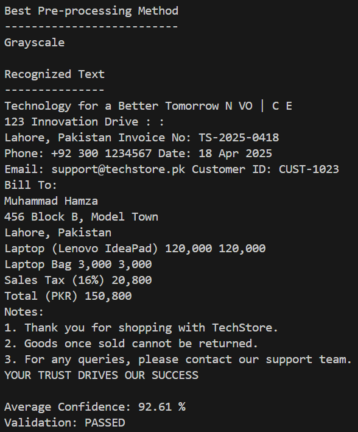
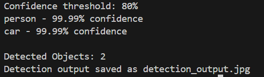
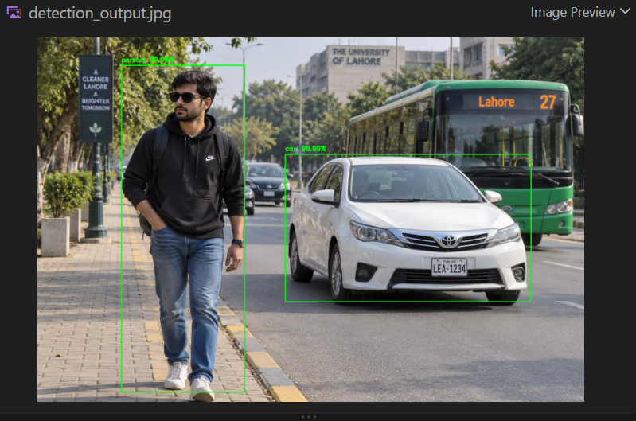

# DecodeLabs AI Project 4 - Image Recognition

## Project Overview

This project was developed as part of the DecodeLabs Artificial Intelligence Industrial Training Program.

The project is a basic image recognition system that demonstrates two common computer vision tasks: text recognition using Tesseract OCR and object detection using a pre-trained MobileNet-SSD model.

The system processes sample images, recognizes text or objects, calculates confidence scores, and displays the results clearly.

## Features

- Processes input images using OpenCV
- Performs image preprocessing for OCR
- Converts images to grayscale
- Applies Gaussian blur
- Uses Otsu thresholding
- Uses Adaptive thresholding
- Extracts text using Tesseract OCR
- Calculates OCR confidence scores
- Performs object detection using MobileNet-SSD
- Uses an 80% confidence threshold
- Draws bounding boxes around detected objects
- Displays object labels and confidence scores
- Saves processed output images

## Part 1 - Text Recognition (OCR)

The OCR part of the project uses Tesseract OCR through the Pytesseract library.

The input image is an invoice containing information such as company details, invoice number, customer information, products, prices, and total amount.

The image is resized and processed using different preprocessing techniques before being passed to Tesseract OCR.

The preprocessing methods tested include:

- Grayscale Conversion
- Gaussian Blur
- Otsu Thresholding
- Adaptive Thresholding

The system compares the confidence scores from the different preprocessing methods and selects the method with the highest confidence.

## OCR Result

The best preprocessing method was:

**Grayscale**

Average OCR confidence:

**92.61%**

Required confidence threshold:

**80%**

Validation result:

**PASSED**

The system successfully recognized the main text from the invoice image.

## Part 2 - Object Detection

The object detection part uses a pre-trained MobileNet-SSD model with OpenCV's DNN module.

The model processes an input image and identifies objects along with their confidence scores.

Only detections with a confidence score of 80% or higher are accepted.

The detected objects are displayed using bounding boxes and labels.

## Object Detection Result

The final test successfully detected:

1. Person - 99.99% confidence
2. Car - 99.99% confidence

Total detected objects:

**2**

Both detections passed the required 80% confidence threshold.

## Concepts Used

- Image Recognition
- Optical Character Recognition
- Image Preprocessing
- Grayscale Conversion
- Gaussian Blur
- Otsu Thresholding
- Adaptive Thresholding
- OCR Confidence Scoring
- Object Detection
- Bounding Boxes
- Confidence Thresholding
- Pre-trained Models
- MobileNet-SSD
- OpenCV DNN

## Technologies Used

- Python 3
- OpenCV
- Pytesseract
- Tesseract OCR
- MobileNet-SSD
- Pillow
- Visual Studio Code

## Project Structure

```text
AI_Project_4/
|
|-- models/
|   |-- deploy.prototxt
|   |-- mobilenet_iter_73000.caffemodel
|
|-- Screenshots/
|   |-- output1.png
|   |-- output2.png
|   |-- output3.png
|
|-- input.jpg
|-- objects.jpg
|-- output.jpg
|-- detection_output.jpg
|-- recognition.py
|-- object_detection.py
|-- requirements.txt
|-- README.md
```

## Author

**Muhammad Hamza**

Software Engineering Student

Iqra University

GitHub: https://github.com/mhamza2004

## Output Screenshots

### OCR Result



### Object Detection Terminal Output



### Object Detection Result


